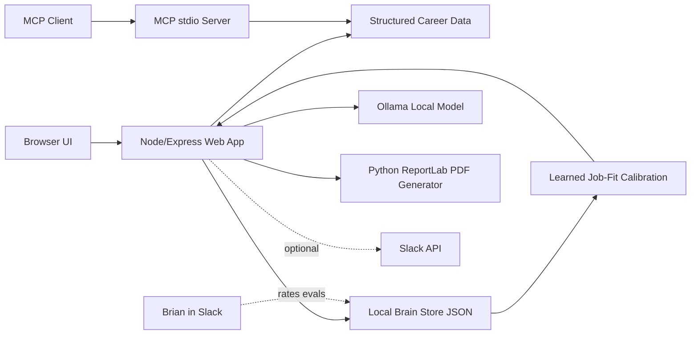
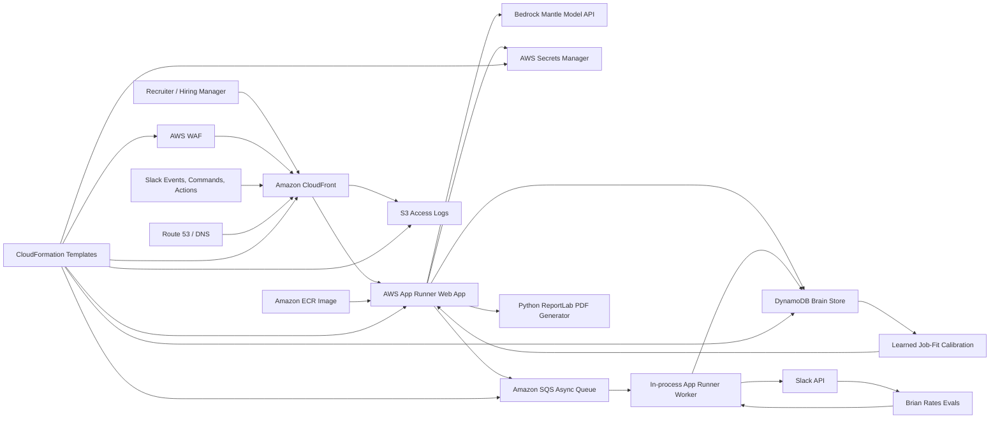

# The Brian Dear Career Agent

A real AI-powered career agent for Brian Dear: part portfolio site, part MCP server, part recruiter-facing interview assistant, part Slack-powered human evaluation loop.

The goal is simple: help hiring managers, recruiters, and technical leaders quickly understand whether Brian is right for a role, a team, or a messy business problem that needs calm engineering judgment.

## What It Does

- Answers questions about Brian's professional background in a conversational web UI.
- Analyzes pasted job descriptions and public HTTPS job-posting links.
- Generates customized PDF resumes.
- Routes recruiter contact requests to Slack.
- Logs public chat activity to Slack.
- Sends Brian mock interview questions in Slack to grow the private career brain.
- Sends human evaluation items in Slack so Brian can rate answer quality and job-fit scoring.
- Saves Brian-approved sample interview answers as reusable career knowledge.
- Persists job-fit ratings as calibration examples that change future scoring behavior for similar roles.
- Exposes Brian's career data through a local MCP server.
- Runs locally with Ollama and in AWS with Bedrock Mantle-compatible hosted inference.

## Tech Stack

TypeScript, Node.js, Express, Model Context Protocol, Ollama, Bedrock Mantle, Python, ReportLab, Slack API, AWS App Runner, Amazon CloudFront, AWS WAF, Amazon SQS, DynamoDB, Amazon S3, Amazon ECR, AWS Secrets Manager, Route 53, and AWS CloudFormation.

Local inference currently defaults to `qwen3:4b` through Ollama. Hosted inference is configured through the Bedrock Mantle OpenAI-compatible endpoint, with the deployed model controlled by `BEDROCK_MODEL`.

## Architecture

### Local Ollama Mode



### AWS Production Mode



CloudFront is used for edge TLS, HTTP/2/3, static asset caching, and a clean public domain. Dynamic routes such as `/api/*` and `/slack/*` are passed through without caching. SQS decouples Slack logging, human evaluation, and mock-interview work from recruiter-facing chat latency.

Job-fit scoring is intentionally feedback-sensitive. Human-eval job descriptions are model-generated across technical, non-technical, excellent-fit, partial-fit, low-fit, and misleading false-positive roles in many industries. When Brian rates a generated job-fit eval as `Good`, `Too high`, `Too low`, or `Incomplete`, the system stores that rating with calibration metadata. Future job descriptions are compared with those rated examples and similar roles are adjusted up or down before the score is returned. This is not just a ratings log; it is the first production learning loop for the scoring engine.

Answer-quality evals are model-generated, not pulled from a static question bank. The configured model invents realistic interview questions across Brian's target role families, recent eval history, and approved brain facts. Static questions remain only as a fallback when the model provider is unavailable. When Brian rates an answer eval `Good`, that question and answer become approved brain knowledge for future responses.

Mock-interview questions are also model-generated. The system uses approved brain facts to ask smarter follow-ups over time, including non-restricted personal topics such as hobbies, music, art, economics, books, travel, design taste, teaching, creative influences, tools, craft, and how Brian thinks.

The apex domain `briandear.ai` permanently redirects to `https://www.briandear.ai/` through a CloudFront Function. The app also enforces the same canonical host as a fallback.

## Requirements

- Node.js 22+
- pnpm
- Python 3 with ReportLab
- Ollama for local model-backed answers
- Docker for container builds
- AWS CLI for CloudFormation deployment
- Slack app with bot token, signing secret, events, interactivity, and slash commands

## Local Setup

```bash
git clone https://github.com/superacidjax/brian-dear-mpc.git
cd brian-dear-mpc
pnpm install
cp .env.example .env
ollama pull qwen3:4b
pnpm dev:web:ollama
```

Open:

```text
http://localhost:4173
```

Run the MCP server locally:

```bash
pnpm build
node dist/server.js
```

Run the async worker locally when `ASYNC_QUEUE_URL` is configured:

```bash
pnpm worker
```

Without `ASYNC_QUEUE_URL`, async jobs run inline so local development stays simple.

## MCP Tools

The MCP server exposes:

- `get_resume_summary`
- `match_job_description`
- `get_project_examples`
- `get_interview_story`
- `get_cover_letter_angle`
- `get_compensation_target`
- `get_public_links`
- `ask_brian_career`

Example MCP client configuration:

```json
{
  "mcpServers": {
    "brian-dear-career": {
      "command": "node",
      "args": ["/absolute/path/to/brian-dear-mpc/dist/server.js"]
    }
  }
}
```

## Public HTTP API

The public web UI uses the unified chat flow:

- `POST /api/chat` for career questions, job-fit analysis, job-posting links, contact collection, and customized resume prompts.
- `POST /api/resume` for downloadable customized PDF generation.
- `POST /api/contact` for direct recruiter contact handoff.
- `GET /api/samples` for suggested starter prompts.

Older duplicate endpoints for direct ask and direct job-match calls have been removed so there is one primary product path.

The resume generator is deterministic and grounded in `src/data/career.json`. It infers the role themes from the pasted job description, selects verified evidence and relevant experience, reorders capabilities, and renders a lightweight ReportLab PDF without inventing employers, dates, claims, or private phone data.

## Environment Variables

Important local variables:

```bash
CAREER_AI_PROVIDER=ollama
OLLAMA_MODEL=qwen3:4b
OLLAMA_BASE_URL=http://localhost:11434
PYTHON_BIN=python3
```

Important hosted variables are provided to App Runner by CloudFormation and Secrets Manager:

```bash
CAREER_AI_PROVIDER=bedrock
BEDROCK_BASE_URL=https://bedrock-mantle.us-east-1.api.aws/v1
BEDROCK_MODEL=openai.gpt-oss-20b
BRAIN_STORE=dynamodb
BRAIN_TABLE_NAME=brian-dear-career-mcp-brain-prod
BRAIN_ENTITY_INDEX_NAME=entityType-createdAt-index
ASYNC_QUEUE_URL=https://sqs...
ASYNC_WORKER_ENABLED=true
ADMIN_TOKEN=stored-in-secrets-manager
ORIGIN_SHARED_SECRET=shared-cloudfront-origin-header
```
Do not commit real secrets!.

## Slack Setup

Configure the Slack app with:

- Events URL: `https://www.briandear.ai/slack/events`
- Interactivity URL: `https://www.briandear.ai/slack/actions`
- Slash command URL: `https://www.briandear.ai/slack/commands`

Slash commands:

- `/brian-question` generates the next adaptive mock interview question.
- `/brian-eval` sends the next human evaluation item.
- `/brian-eval job` requests a job-fit scoring evaluation.
- `/brian-eval answer` requests an answer-quality evaluation.

Recommended channels:

- `career-agent-user-log`
- `career-agent-human-evals`
- `career-agent-mock-interview`
- `career-agent-interview-requests`

Invite the Slack bot to each channel and configure the corresponding channel IDs in CloudFormation parameters or Secrets Manager.

## AWS Deployment

Runtime infrastructure is managed with plain CloudFormation YAML.

Templates:

- `infra/cloudformation/ecr-repository.yaml`
- `infra/cloudformation/brian-career-agent.yaml`

The CloudFormation stack is the source of truth for production infrastructure. `scripts/deploy_aws.sh` is deprecated reference material and should not be used for normal deployments.

Production secrets should be created in Secrets Manager before deploying the runtime stack. CloudFormation receives secret ARNs, not raw API keys or Slack tokens.

### 1. Create Or Reuse ECR

If the ECR repository does not already exist:

```bash
aws cloudformation deploy \
  --stack-name brian-dear-career-mcp-ecr \
  --template-file infra/cloudformation/ecr-repository.yaml \
  --region us-east-1
```

Get the repository URI:

```bash
aws cloudformation describe-stacks \
  --stack-name brian-dear-career-mcp-ecr \
  --region us-east-1 \
  --query "Stacks[0].Outputs[?OutputKey=='RepositoryUri'].OutputValue" \
  --output text
```

### 2. Build And Push The Image

```bash
export AWS_ACCOUNT_ID=123456789012
export AWS_REGION=us-east-1
export IMAGE_TAG=$(git rev-parse --short HEAD)
export ECR_REPO=$AWS_ACCOUNT_ID.dkr.ecr.$AWS_REGION.amazonaws.com/brian-dear-career-mcp

aws ecr get-login-password --region $AWS_REGION \
  | docker login --username AWS --password-stdin $AWS_ACCOUNT_ID.dkr.ecr.$AWS_REGION.amazonaws.com

docker build -t brian-dear-career-mcp:$IMAGE_TAG .
docker tag brian-dear-career-mcp:$IMAGE_TAG $ECR_REPO:$IMAGE_TAG
docker push $ECR_REPO:$IMAGE_TAG
```

For CI/CD-style builds, `buildspec.yml` builds the Docker image and pushes it to ECR. Configure CodeBuild with:

- `AWS_ACCOUNT_ID`
- `AWS_DEFAULT_REGION`
- `IMAGE_REPO_NAME`
- `IMAGE_TAG`

The build writes `imageDetail.json` with the pushed image URI. Use that image URI as the `ContainerImageUri` CloudFormation parameter.

### 3. Deploy Or Update The Runtime Stack

`CertificateArn` must be an ACM certificate in `us-east-1` for `www.briandear.ai`. If Route 53 hosts the zone, pass `HostedZoneId`; otherwise create the DNS record manually after CloudFormation outputs the CloudFront domain.

Create or update required secrets first:

```bash
aws secretsmanager create-secret \
  --name /brian-dear-career-mcp/prod/BEDROCK_API_KEY \
  --secret-string "$BEDROCK_API_KEY" \
  --region us-east-1
```

Repeat that pattern for:

- `/brian-dear-career-mcp/prod/SLACK_BOT_TOKEN`
- `/brian-dear-career-mcp/prod/SLACK_SIGNING_SECRET`
- `/brian-dear-career-mcp/prod/SLACK_BRIAN_USER_ID`
- `/brian-dear-career-mcp/prod/SLACK_USER_LOG_CHANNEL_ID`
- `/brian-dear-career-mcp/prod/SLACK_HUMAN_EVAL_CHANNEL_ID`
- `/brian-dear-career-mcp/prod/SLACK_MOCK_INTERVIEW_CHANNEL_ID`
- `/brian-dear-career-mcp/prod/SLACK_INTERVIEW_REQUEST_CHANNEL_ID`
- `/brian-dear-career-mcp/prod/ADMIN_TOKEN`

For existing secrets, use `aws secretsmanager put-secret-value` instead of `create-secret`.

Export the ARNs:

```bash
export BEDROCK_API_KEY_SECRET_ARN=$(aws secretsmanager describe-secret --secret-id /brian-dear-career-mcp/prod/BEDROCK_API_KEY --query ARN --output text --region us-east-1)
export SLACK_BOT_TOKEN_SECRET_ARN=$(aws secretsmanager describe-secret --secret-id /brian-dear-career-mcp/prod/SLACK_BOT_TOKEN --query ARN --output text --region us-east-1)
export SLACK_SIGNING_SECRET_SECRET_ARN=$(aws secretsmanager describe-secret --secret-id /brian-dear-career-mcp/prod/SLACK_SIGNING_SECRET --query ARN --output text --region us-east-1)
export SLACK_BRIAN_USER_ID_SECRET_ARN=$(aws secretsmanager describe-secret --secret-id /brian-dear-career-mcp/prod/SLACK_BRIAN_USER_ID --query ARN --output text --region us-east-1)
export SLACK_USER_LOG_CHANNEL_ID_SECRET_ARN=$(aws secretsmanager describe-secret --secret-id /brian-dear-career-mcp/prod/SLACK_USER_LOG_CHANNEL_ID --query ARN --output text --region us-east-1)
export SLACK_HUMAN_EVAL_CHANNEL_ID_SECRET_ARN=$(aws secretsmanager describe-secret --secret-id /brian-dear-career-mcp/prod/SLACK_HUMAN_EVAL_CHANNEL_ID --query ARN --output text --region us-east-1)
export SLACK_MOCK_INTERVIEW_CHANNEL_ID_SECRET_ARN=$(aws secretsmanager describe-secret --secret-id /brian-dear-career-mcp/prod/SLACK_MOCK_INTERVIEW_CHANNEL_ID --query ARN --output text --region us-east-1)
export SLACK_INTERVIEW_REQUEST_CHANNEL_ID_SECRET_ARN=$(aws secretsmanager describe-secret --secret-id /brian-dear-career-mcp/prod/SLACK_INTERVIEW_REQUEST_CHANNEL_ID --query ARN --output text --region us-east-1)
export ADMIN_TOKEN_SECRET_ARN=$(aws secretsmanager describe-secret --secret-id /brian-dear-career-mcp/prod/ADMIN_TOKEN --query ARN --output text --region us-east-1)
export ORIGIN_VERIFY_HEADER_VALUE=$(openssl rand -hex 32)
```

```bash
aws cloudformation deploy \
  --stack-name brian-dear-career-mcp-prod \
  --template-file infra/cloudformation/brian-career-agent.yaml \
  --region us-east-1 \
  --capabilities CAPABILITY_NAMED_IAM \
  --parameter-overrides \
    ContainerImageUri=$ECR_REPO:$IMAGE_TAG \
    DomainName=www.briandear.ai \
    HostedZoneId=Z1234567890 \
    CertificateArn=arn:aws:acm:us-east-1:123456789012:certificate/abc123 \
    BedrockApiKeySecretArn=$BEDROCK_API_KEY_SECRET_ARN \
    SlackBotTokenSecretArn=$SLACK_BOT_TOKEN_SECRET_ARN \
    SlackSigningSecretSecretArn=$SLACK_SIGNING_SECRET_SECRET_ARN \
    SlackBrianUserIdSecretArn=$SLACK_BRIAN_USER_ID_SECRET_ARN \
    SlackUserLogChannelIdSecretArn=$SLACK_USER_LOG_CHANNEL_ID_SECRET_ARN \
    SlackHumanEvalChannelIdSecretArn=$SLACK_HUMAN_EVAL_CHANNEL_ID_SECRET_ARN \
    SlackMockInterviewChannelIdSecretArn=$SLACK_MOCK_INTERVIEW_CHANNEL_ID_SECRET_ARN \
    SlackInterviewRequestChannelIdSecretArn=$SLACK_INTERVIEW_REQUEST_CHANNEL_ID_SECRET_ARN \
    AdminTokenSecretArn=$ADMIN_TOKEN_SECRET_ARN \
    OriginVerifyHeaderValue=$ORIGIN_VERIFY_HEADER_VALUE \
    EnableWaf=true \
    WafRateLimit=1200
```

On later updates, use `--use-previous-template` or `UsePreviousValue=true` in the console for secrets you are not rotating.

For image-only updates after CodeBuild pushes a new tag, update the App Runner service through CloudFormation by changing only `ContainerImageUri`. If you update App Runner directly during development, preserve the existing runtime variables and secrets, especially `BRAIN_ENTITY_INDEX_NAME`.

### 4. DNS

If `HostedZoneId` was provided, CloudFormation creates an alias record for `www.briandear.ai`.

If DNS is managed elsewhere, create a CNAME or ALIAS from `www.briandear.ai` to the `CloudFrontDomainName` output.

The apex `briandear.ai` should route to the CloudFront redirect distribution and return `301` to the matching path on `https://www.briandear.ai`.

## Security And Scalability

- Helmet security headers and CSP.
- Express rate limiting.
- Gzip/Brotli-friendly compression.
- App Runner health check endpoint.
- Production admin endpoints fail closed when `ADMIN_TOKEN` is missing.
- Production origin requests can be restricted to CloudFront with a shared origin header.
- Slack signature verification.
- Slack retry/backoff for rate limits and transient failures.
- SQS buffering for Slack logs, human evals, and mock interview jobs.
- AWS WAF managed rules and edge rate limiting in front of App Runner.
- CloudFront access logs stored in S3 with lifecycle expiration.
- DynamoDB point-in-time recovery, deletion protection, encryption, and query index.
- CloudFront dynamic routes configured with caching disabled.
- Static assets cached at the edge.
- Public job-link fetches require HTTPS, reject private network targets, pin DNS resolution for the outbound request, and validate redirects.
- PDF generation timeout and output size cap.
- PDF output signature validation before download.
- Non-root container runtime.

Remaining recommended production additions:

- A dedicated ECS/Fargate worker if async volume outgrows the in-process App Runner worker.
- RDS PostgreSQL with pgvector if the brain grows beyond structured DynamoDB facts and evals.

## Validation

```bash
pnpm typecheck
pnpm lint
pnpm format:check
pnpm test
pnpm test:job-match
pnpm audit --audit-level moderate
```

The Vitest suite covers the human-eval calibration path, learned job-fit scoring, security-sensitive HTTP routes, Slack payload handling, job-link validation, and PDF failure handling. The job-match regression check keeps obviously unrelated teacher and retail roles from scoring as good fits.

## Assets

Technology logo provenance and update rules are documented in `docs/asset-attribution.md`.
