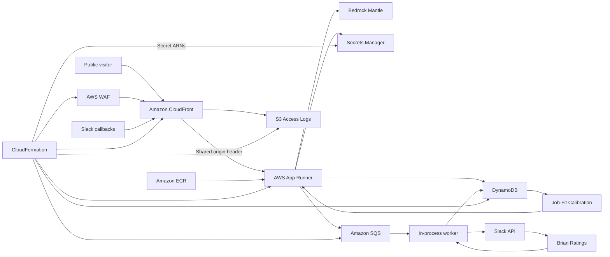

# AWS Production Architecture

The production architecture is CloudFormation-managed and optimized for a recruiter-facing public application with low operational burden.

## Current Production Path

- CloudFront is the public edge in front of the application.
- The CloudFront distribution permanently redirects `briandear.ai` to `https://www.briandear.ai`.
- AWS WAF attaches to CloudFront with managed rules and an edge rate limit.
- App Runner runs the Node/Express web app.
- The same App Runner container runs a lightweight SQS worker loop when `ASYNC_WORKER_ENABLED=true`.
- SQS buffers Slack logging, human evaluation, and mock interview jobs.
- DynamoDB stores brain facts, mock interview questions, answer evaluations, and job-fit calibration examples.
- S3 stores CloudFront access logs with lifecycle expiration.
- Secrets Manager stores Bedrock Mantle, Slack, and admin secrets; CloudFormation receives secret ARNs rather than raw secret values.
- Bedrock Mantle provides hosted OpenAI-compatible model inference.
- Route 53 can point `www.briandear.ai` at CloudFront when the hosted zone is managed in AWS.
- ECR stores the container image.

## Why CloudFront

CloudFront gives the public site edge TLS, HTTP/2/3, and global caching for static assets. AWS WAF adds managed common-rule protection, known-bad-input filtering, and an IP-based rate limit before requests reach App Runner. Dynamic routes under `/api/*` and `/slack/*` are not cached. CloudFront also sends a shared origin-verification header so the app can reject direct App Runner requests in production.

The root-domain redirect belongs at the edge. `briandear.ai` should return a `301` from CloudFront before it reaches App Runner, preserving path and query string while changing the host to `www.briandear.ai`.

## Why SQS

SQS keeps non-critical background work from slowing down recruiter-facing chat. Public answers stay synchronous; Slack logs, human evaluations, mock interview questions, and contact notifications are queued. A dead-letter queue captures failed jobs after repeated attempts.

## Learning Loop

Human eval ratings are part of the runtime behavior. The model generates varied job-fit eval descriptions across technical, non-technical, excellent-fit, partial-fit, low-fit, and misleading false-positive roles. When Brian rates a job-fit scoring eval in Slack, the worker persists calibration metadata in DynamoDB. Future job-fit requests compare the new job description with rated examples and apply a weighted adjustment before returning the score. This gives the production scorer immediate feedback without waiting for an offline fine-tuning pipeline.

Mock-interview questions are also model-generated. The generator uses approved brain facts to ask follow-up questions that deepen Brian's profile across professional stories and non-restricted personal context such as hobbies, music, art, economics, books, travel, design taste, teaching, tools, craft, and creative influences.

## Scaling Notes

The current App Runner autoscaling target is intentionally conservative: minimum one instance, maximum three instances, and SQS-backed async work. This is enough for a portfolio/public recruiter app.

Move the worker to ECS/Fargate when:

- Slack/eval volume grows enough to compete with public chat latency.
- Resume generation becomes asynchronous.
- The worker needs separate scaling or resource limits.

Move the brain to PostgreSQL with pgvector when:

- The number of approved facts and evals grows beyond simple DynamoDB querying.
- Retrieval needs semantic vector search, richer filtering, or audit-heavy answer traces.

Add true fine-tuning when the eval dataset is large enough to justify it and after the app has an offline evaluation suite that can catch regressions before a tuned model reaches production.

## Local Model Path

Ollama remains the local development path and a portfolio signal. Production uses hosted inference because it is easier to operate reliably for a public site.
